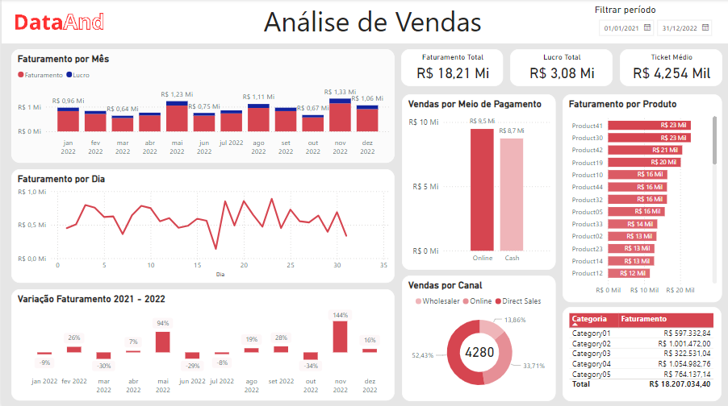

# Relatório de vendas - Power BI 

O relatório apresenta dados de vendas dos produtos comercializados por uma empresa fictisia, com produtos distintos e diversas categorias.
Dentre os insights  elaborados com as visões do Power BI, estão faturamentos mensal e lucro, faturamento por dia, taxa de lucro mês-a-mês, vendas por canais e quantidade total de vendas,
faturamento por produto e qual a categoria apresenta o melhor desempenho.

Esse foram os pontos que optei por explorar a principio, com base na fonte de dados escolhida e que imagino que sejam relevantes para um equipe gerencial de vendas ou um time comercial.
 
